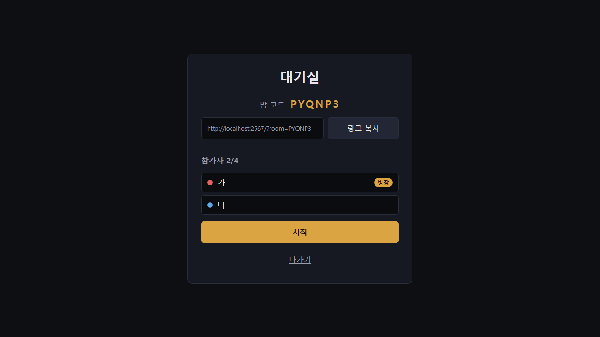
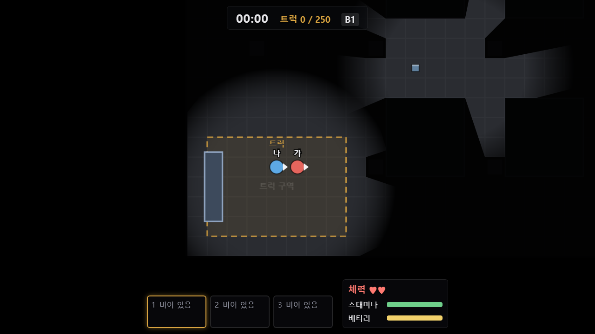
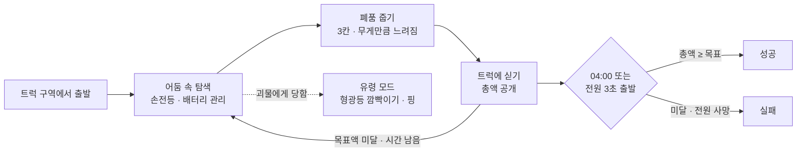
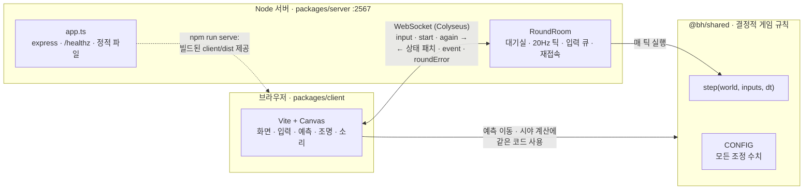
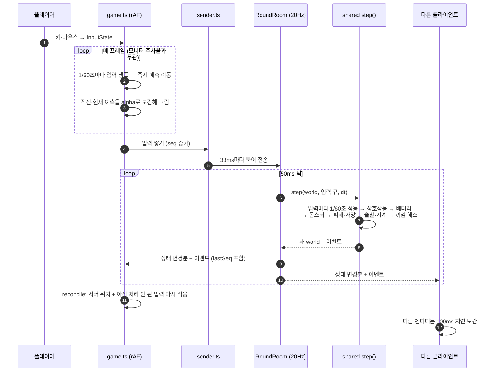
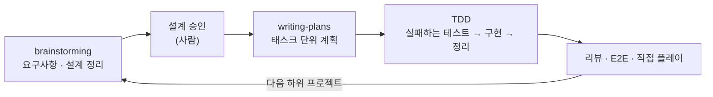

# 지하주차장 (basement-horror)

[](https://github.com/jomin4/recent-superpowers-project/actions/workflows/ci.yml)


오래된 아파트 지하주차장에서 친구 1~4명이 **브라우저 링크 하나로** 모여 즐기는 2D 탑다운 협동 서바이벌 공포 게임.

> 어둠 속에 들어가 폐품을 모으고, 소리에 반응하는 경비원과 비추면 멈추는 귀신을 피해,
> 새벽 4시(실제 12분) 트럭이 떠나기 전에 목표액을 싣고 빠져나온다.

| 대기실 (초대 링크로 입장) | 게임 화면 (어둠 · 손전등 · HUD) |
|---|---|
|  |  |

> 그래픽은 도형 + 조명 효과로 만든 임시본이다. 렌더러가 엔티티 종류만 받도록 분리해 두어 픽셀 아트로 바꿀 수 있다(로드맵 3단계).

---

## 목차

1. [프로젝트 개요](#1-프로젝트-개요)
2. [게임 소개](#2-게임-소개)
3. [기술 스택](#3-기술-스택)
4. [아키텍처](#4-아키텍처)
5. [기술적 핵심](#5-기술적-핵심)
6. [문제 해결 기록](#6-문제-해결-기록)
7. [테스트](#7-테스트)
8. [개발 방식](#8-개발-방식)
9. [실행 방법](#9-실행-방법)
10. [프로젝트 구조](#10-프로젝트-구조)
11. [로드맵과 남은 과제](#11-로드맵과-남은-과제)
12. [문서](#12-문서)

---

## 1. 프로젝트 개요

| 항목 | 내용 |
|---|---|
| 장르 | 2D 탑다운 협동 서바이벌 공포 (리썰 컴퍼니의 "들어가서 모으고 제시간에 빠져나오기" 루프를 한국형 괴담 배경으로) |
| 플랫폼 | PC 웹 브라우저 (키보드 · 마우스). 친구는 아무것도 설치하지 않고 링크로 들어온다 |
| 인원 | 1~4명, 인원에 따라 목표액과 몬스터 수가 달라진다 |
| 네트워크 | 서버 판정(authoritative server) + 클라이언트 예측 · 보정 · 보간 |
| 현재 단계 | 하위 프로젝트 1 **"라운드 1회"** 완료: 맵, 몬스터 2종, 트럭 운반, 유령 모드, 1~4인 온라인 협동 |
| 규모 | 소스 약 6,000줄 (shared 2.4k · client 3.0k · server 0.6k), 테스트 코드 약 6,500줄 |
| 품질 | 단위 · 시나리오 · 퍼즈 · 서버 통합 테스트 725개 + Playwright E2E 5개, GitHub Actions CI |

---

## 2. 게임 소개

### 핵심 루프



### 시간 흐름 (게임 시계 00:00 → 04:00, 실제 12분)

| 시각 | 사건 |
|---|---|
| 00:30 | 시선형(무궁화 귀신) 등장 |
| 03:00 | 남은 고정 조명의 절반이 꺼지고 추적형 속도 +10% |
| 03:50 | 트럭 경적 (10분 전 경고) |
| 04:00 | 트럭 자동 출발. 트럭 구역 밖 생존자는 사망 |

### 몬스터

| 몬스터 | 행동 | 대응 |
|---|---|---|
| **추적형 · 옛 경비원** | 배회 → 소리 조사 → 추격(층 안 A*) → 수색 → 공격 후 후퇴. 발소리로 접근을 알린다 | 뛰지 않기(걷기 1.5칸, 뛰기 8칸 소음), 손전등으로 비추면 오히려 들킨다 |
| **시선형 · 무궁화 귀신** | 가장 가까운 생존자에게 계단을 넘나들며 접근(초당 5.5칸). 닿으면 즉사 | 생존자 누구든 손전등으로 비추면 그 틱에 멈춘다 → "비춰줘!" 협동 |

### 인원별 난이도

| 인원 | 목표액 | 추적형 |
|---|---|---|
| 1명 | 150 | 1마리 (속도 −15%) |
| 2명 | 250 | 1마리 |
| 3명 | 350 | 2마리 (층마다 1) |
| 4명 | 450 | 2마리 (층마다 1) |

### 그 밖의 시스템

- **조명과 시야**: 화면 전체가 어둡고, 플레이어 주변 빛(1.5칸) · 손전등(60°, 8칸) · 고정 조명만 벽에 막힌 모양으로 뚫린다. 빛 밖의 몬스터와 폐품은 그리지 않는다.
- **소리**: Web Audio 합성음에 거리 감쇠와 좌우 패닝. 다른 층 소리는 들리지 않는다. 몬스터가 5칸 안이면 비네트와 심장 소리.
- **유령 모드**: 죽으면 벽을 통과하는 유령이 되어 형광등을 깜빡여(쿨타임 10초) 동료에게 신호를 준다.
- **소통**: 게임 안 음성 대신 퀵챗 6종(T + 1~6)과 마우스 위치 핑(Q).
- **입장**: 6자리 방 코드와 초대 링크(`/?room=CODE`). 모르는 사람과 자동 매칭되지 않는다.

모든 수치는 [`packages/shared/src/config.ts`](packages/shared/src/config.ts)의 `CONFIG` 한 곳에 모여 있어 플레이 테스트 후 바로 조정할 수 있다.

---

## 3. 기술 스택

| 영역 | 기술 | 쓰는 곳 |
|---|---|---|
| 언어 | TypeScript 7 (strict), Node.js 22.12+ | 전체 (npm workspaces 모노레포) |
| 게임 규칙 | 순수 TypeScript, mulberry32 시드 RNG | `packages/shared` — 네트워크와 화면을 모르는 결정적 규칙 |
| 서버 | Colyseus 0.18, `@colyseus/schema` 5, Express 5 | `packages/server` — 방 · 상태 동기화 · 정적 파일 제공 |
| 클라이언트 | Vite 8, Canvas 2D, Web Audio, `@colyseus/sdk` | `packages/client` — 프레임워크 없이 DOM + Canvas |
| 테스트 | Vitest 5, `@colyseus/testing`, Playwright | 단위 · 시나리오 · 퍼즈 · 서버 통합 · E2E |
| CI | GitHub Actions | 푸시마다 타입 검사 + 테스트 + 빌드 |
| 공유 | Cloudflare Quick Tunnel | 내 PC 서버를 친구에게 공개 |

---

## 4. 아키텍처

세 패키지가 역할을 나눈다. **규칙은 `shared`에만 있고**, 서버는 그 규칙을 실행하며, 클라이언트는 예측 이동과 시야 계산에만 같은 코드를 쓴다.



### 한 프레임 · 한 틱의 데이터 흐름



모듈 단위 구조(클라이언트 · 서버 · 공용 규칙)는 [docs/architecture.md](docs/architecture.md)에 있다.

### 설계 원칙

| 원칙 | 내용 |
|---|---|
| 서버 판정 | 피격 · 줍기 · 시선 정지 · 사망 · 라운드 결과는 항상 서버 결과를 따른다 |
| 결정성 | `step`은 순수 함수다. 같은 시드와 같은 입력이면 같은 결과가 나오고, 시간은 `dt` 인자로만 받는다 |
| 규칙의 단일 위치 | 규칙과 조정 수치는 `shared`에만 둔다. 클라이언트 예측이 서버와 같은 코드를 실행한다 |
| 행동 단위 입력 | 키가 아니라 행동(이동 방향, 뛰기, 조준 각도, 손전등, 상호작용 …)을 보낸다 → 모바일 터치로 확장 가능 |
| 교체 가능한 그래픽 | 렌더러의 그리기 표(`drawTable`)만 바꾸면 도형 → 스프라이트로 교체된다 |

---

## 5. 기술적 핵심

### 5.1 결정적 시뮬레이션 (`packages/shared`)

- 한 틱 처리 순서를 고정했다: **입력 → 상호작용 → 배터리 → 추적형 · 시선형 → 피해 · 사망 → 출발 · 시계 → 끼임 해소**.
- `step(world, inputs, dt)`는 입력 world를 바꾸지 않고 새 world를 돌려준다. 틱마다 쓰는 깊은 복사는 JSON 왕복 대신 손으로 작성해 약 2배 빠르게 했다.
- 난수는 world 안의 mulberry32 상태로만 뽑아, 시드가 같으면 300틱을 돌려도 결과가 완전히 같다(테스트로 확인).
- 맵은 JSON으로 두고 서버 시작 시 검증한다(층 크기와 타일 문자, 계단 짝, 트럭 구역 · 스폰 위치, 폐품 후보 칸과 순찰 경로가 걸을 수 있고 트럭 구역에서 닿을 수 있는지 등). 실패하면 서버가 시작하지 않는다.

### 5.2 넷코드: 예측 · 보정 · 보간

| 대상 | 방식 |
|---|---|
| 입력 | 모니터 주사율(30~360Hz)과 무관하게 **고정 60Hz로 샘플링**, 33ms마다 묶어 전송. 각 입력에 순번(seq) |
| 내 캐릭터 | 입력을 즉시 `shared/movement`로 적용(예측). 서버 상태가 오면 서버 위치에서 아직 처리되지 않은 입력을 다시 적용(보정). 그릴 때는 직전 · 현재 예측 위치를 다음 샘플까지 남은 비율로 보간 |
| 서버의 입력 시간 | 입력 하나 = 정확히 1/60초. 플레이어별로 **실제 흐른 시간만큼만** 입력을 쓰고(최대 0.2초 쌓임) 남은 입력은 다음 틱으로 넘긴다 → 예측과 서버가 정확히 일치하고, 입력을 많이 보내도 빨라지지 않는다 |
| 다른 플레이어 · 몬스터 | 100ms 지연된 두 스냅숏 사이를 보간. 조준 각도는 짧은 호로 보간, 층이 바뀌거나 1초 이상 끊기면 바로 최신 값 |
| 일회성 입력 | 손전등 토글 · 버리기 · 핑 같은 "엣지" 입력은 큐가 넘쳐 버려질 때도 남는 입력에 접어서 잃지 않는다 |

### 5.3 시야 · 조명

- 벽 칸의 외곽선만 선분으로 뽑고 같은 직선 위 선분은 합쳐 둔다(맵 · 층별 메모이즈).
- 광원마다 선분 끝점 방향으로 광선을 쏴 **가시 다각형(visibility polygon)** 을 만들고, 손전등은 조준 ± 30° 부채꼴로 자른다.
- 어둠 레이어를 화면 전체에 덮은 뒤 내 층의 모든 광원 다각형을 뚫는다. 화면 안의 광원만 계산한다.
- 같은 판정 함수(`hasLineOfSight`, `inFlashlight`)를 서버는 몬스터 발견 · 시선형 정지에, 클라이언트는 "무엇을 그릴지"에 쓴다.

### 5.4 몬스터 AI

- **추적형**: 배회 · 조사 · 추격 · 수색 · 후퇴 5상태 상태 기계. 소리(직선 거리 반경)와 시야(6칸 + 벽 차단, 또는 손전등에 비춰짐)로 전환한다. 갈 수 없는 목표는 배회로 돌아간다.
- **시선형**: 매 틱 "같은 층의 생존자 손전등에 보이는가"를 판정해 멈추거나, 경로 길이 기준 가장 가까운 생존자에게 계단을 넘어 접근한다. 경로가 없으면 1초 기다렸다 다시 찾는다.
- **길찾기**: 8방향 A* (대각선은 양옆 칸이 열려 있을 때만), 계단 칸은 짝 계단으로 순간 이동하는 간선. 우선순위가 같으면 먼저 넣은 쪽이 먼저 나오는 이진 힙으로 결과를 결정적으로 만들었다.

### 5.5 서버 견고성

- 입력 검증(`sanitizeInput`): 형식이 틀리거나 범위를 벗어난 값은 버리거나 잘라낸다. NaN · Infinity · 거대한 벡터도 안전하게 정규화.
- 메시지 빈도 제한(초당 60개 초과분 폐기), 플레이어당 입력 큐 10개, 퀵챗 · 핑 · 깜빡이기 서버 쿨타임.
- 연결이 끊기면 20초 재접속 유예, 넘으면 사망 처리 후 소지품 낙하. 탭을 닫으면 끊김이 아니라 자발적 퇴장으로 처리.
- 틱에서 예외가 나면 그 방의 라운드만 끝내고 서버는 계속 동작한다(시드 · 틱을 로그로 남겨 재현 가능).
- 방은 비공개로 만들어 방 코드(`joinById`)로만 들어올 수 있다. 클라이언트 · 서버 버전이 다르면 입장을 거부한다.

---

## 6. 문제 해결 기록

개발 중 만난 문제와 원인, 해결 방법. 모두 실패하는 테스트로 재현한 뒤 고쳤다.

| 문제 | 원인 | 해결 |
|---|---|---|
| **60Hz 모니터에서 내 캐릭터 · 카메라가 미세하게 떨림** | ① 프레임 간격이 1/60초 근처에서 흔들려 프레임당 입력 샘플 수가 0/1/2로 튐. 카메라도 샘플 적용 전 위치를 따라가 한 프레임 늦음<br/>② 서버가 틱 dt를 받은 입력 수로 나눔. 33ms 묶음 · 50ms 틱이라 틱마다 입력이 2개/4개로 번갈아 와서 입력 하나가 25ms/12.5ms로 적용 → 클라이언트 예측(16.7ms)과 매 틱 어긋나 50ms마다 위치가 튐 | ① 샘플 시계에 `alpha()`(다음 샘플까지 남은 비율)를 두고 직전 · 현재 예측 사이를 보간해 그림<br/>② 서버도 입력 하나를 정확히 1/60초로 적용하고, 흐른 시간 예산만큼만 쓰고 나머지는 다음 틱으로 넘김<br/>→ 실제 브라우저 측정에서 속도가 30% 이상 튀는 프레임이 약 170프레임 중 26~33개 → 2~3개(방향 전환 순간)로 감소 |
| 144Hz 이상 모니터에서 손전등 토글 등이 가끔 씹힘 | 입력을 rAF 프레임마다 만들어 서버 큐 한도(틱당 10개)를 넘었고, 버려진 입력에 엣지가 들어 있었음 | 입력을 고정 60Hz로 샘플링. 서버는 버리는 입력의 엣지를 남는 입력에 접는 `capInputs`로 이중 방어 |
| 한 틱 안에서 E를 짧게 눌렀다 떼면 줍기가 안 됨 | 틱의 마지막 입력 상태만 이전 틱과 비교 | 틱 안의 모든 입력을 훑으며 누름 엣지를 기록 |
| "3초 누르면 출발"이 61틱 만에 출발 | dt 0.05를 60번 더하면 부동소수 오차로 3.0에 살짝 못 미침 | 다른 타이머와 같은 1e-9 허용 오차로 비교, 테스트는 정확히 60틱을 확인 |
| 다른 플레이어 손전등이 ±180° 근처에서 반대로 크게 돎 | 조준 각도를 선형 보간 | `angleDiff`로 짧은 호를 따라 보간 |
| 스태미나를 조금씩 끊어 쓰면 계속 뛸 수 있음 | 스태미나가 0이 되어도 조금만 회복하면 바로 다시 뛸 수 있었음 | 탈진 상태 추가: 바닥나면 일정량 회복될 때까지 뛰지 못함 |
| 낯선 사람이 내 방에 매칭될 수 있음 | Colyseus `joinOrCreate`가 공개 방을 골라 들어감 | 방 생성 시 `setPrivate(true)` → 방 코드로만 입장 |
| 라운드 중 탭을 닫으면 20초 동안 캐릭터가 남음 | 닫기가 비정상 끊김(1001)으로 처리되어 재접속 유예 시작 | `pagehide`에서 자발적 퇴장(`leave(true)`)을 보냄. E2E로 2초 안에 사망 처리 확인 |
| 서버를 끈 뒤에도 2567 · 5173 포트가 계속 점유됨 | 실행 스크립트가 자식 프로세스 트리를 정리하지 않아 고아 프로세스가 남음 | 종료 시 서버 프로세스 트리 전체를 정리하도록 `scripts/run.mjs` 수정 |

---

## 7. 테스트

```bash
npm test        # 타입 검사 + 단위·시나리오·퍼즈·서버 통합 테스트 (브라우저 필요 없음)
npm run e2e     # Playwright E2E: 실제 브라우저 두 개로 초대 링크 입장 → 시작 → 이동
```

| 단계 | 대상 | 도구 | 개수 |
|---|---|---|---|
| 단위 · 시나리오 · 퍼즈 | `shared` 모든 규칙, `step` 다중 틱, 시드 100개 × 무작위 입력 | Vitest | 475 |
| 클라이언트 단위 | 입력 샘플링, 예측 · 보정, 보간, 시야 필터, HUD, 오디오 판단 | Vitest | 198 |
| 서버 통합 | 정원 · 진행 중 입장 거부, 재접속, 방장 이전, 잘못된 메시지, 입력 큐, 버전 불일치 | Vitest + `@colyseus/testing` | 52 |
| E2E | 두 명 입장 · 이동, 탭 닫기 퇴장, 없는 방 코드, Esc 메뉴, 방 코드 입력 | Playwright (Chromium) | 5 |

퍼즈 테스트는 시드 100개마다 무작위 입력으로 최대 2분을 돌리고, 8개 시나리오는 라운드가 끝날 때까지 돌리며 불변 조건을 매 틱 확인한다.

- 어떤 엔티티도 벽 안에 없다.
- 트럭 총액은 실린 폐품 가치의 합과 같다.
- 사망한 플레이어는 폐품을 갖고 있지 않다.

승리 경로(조기 출발 성공, 시계 종료와 `left_behind`, B2 이동)가 실제로 실행되었는지도 함께 확인한다.

커버리지 수치 목표 대신 "`shared`의 모든 규칙에 테스트가 있어야 한다"를 원칙으로 둔다. GitHub Actions가 푸시마다 `npm ci → npm test → npm run build`를 실행한다.

E2E 실행 메모:

- `npm run e2e`는 클라이언트를 빌드하고 서버를 띄운 뒤(`npm run serve`) 실제 브라우저로 확인한다. 이미 2567 포트에 서버가 떠 있으면 그 서버를 재사용하므로, 최신 코드를 테스트하려면 먼저 종료한다.
- 처음 한 번 `npx playwright install chromium`이 필요하다. 스크린샷은 `test-results/`(git 제외)에 저장된다.
- 브라우저를 설치할 수 없는 클라우드 환경에서는 이미 있는 Chromium 경로를 지정한다.

  ```bash
  PLAYWRIGHT_CHROMIUM_PATH=/opt/pw-browsers/chromium-1194/chrome-linux/chrome npm run e2e
  ```

---

## 8. 개발 방식

[Claude Code](https://claude.com/claude-code)와 함께, 기능마다 **설계 → 계획 → TDD** 순서를 지켜 만들었다([`CLAUDE.md`](CLAUDE.md)).



- **설계 스펙**: 게임 규칙 · 네트워크 · 화면 · 오류 처리 · 테스트 전략을 한 문서로 확정 → [설계 문서](docs/superpowers/specs/2026-10-02-basement-horror-round-design.md)
- **구현 계획**: 20개 태스크로 쪼개 순서대로 구현 → [구현 계획](docs/superpowers/plans/2026-10-02-basement-horror-round.md)
- **TDD**: 버그 수정도 재현 테스트를 먼저 쓰고 실패를 확인한 뒤 고쳤다(6장의 모든 항목).
- **커밋**: Conventional Commits(`feat(shared): …`, `fix(server): …`)로 패키지 단위 범위를 표시했다.
- **스킬**: `.claude/skills/`의 워크플로 스킬은 [obra/superpowers](https://github.com/obra/superpowers)(커밋 `8ca22db`, MIT, `.claude/skills/LICENSE-superpowers`)에서 가져왔다.
- **원격 개발**: PC에서 `claude remote-control`을 실행해 두면 휴대폰 Claude 앱에서 같은 세션으로 개발과 플레이 테스트를 이어 갈 수 있다(PC에 Claude Code 설치 · 로그인 필요).

---

## 9. 실행 방법

### 요구사항

- Node.js 22.12 이상 (LTS 권장), Git
- 친구는 PC 브라우저만 있으면 된다.

### 설치와 개발 서버

```bash
git clone https://github.com/jomin4/recent-superpowers-project.git
cd recent-superpowers-project
git checkout ccr-07fd93bb-obo8mr
npm install
npm run dev
```

게임 코드는 아직 `ccr-07fd93bb-obo8mr` 브랜치에만 있다(main에 합쳐지면 `git checkout` 단계는 필요 없다).
http://localhost:5173 을 연다. 서버는 2567, Vite 개발 서버는 5173 포트를 쓴다.

### 친구와 하기

1. 내 PC에서 서버를 띄운다. 클라이언트를 빌드해 같은 포트(2567)로 함께 제공한다.

   ```bash
   npm run serve
   ```

   http://localhost:2567 에서 혼자 먼저 확인해 볼 수 있다.

2. `cloudflared`를 설치한다(처음 한 번).
   - Windows: `winget install --id Cloudflare.cloudflared` (설치 후 새 터미널을 연다)
   - macOS: `brew install cloudflared`
   - 그 밖: [Cloudflare 다운로드 페이지](https://developers.cloudflare.com/cloudflare-one/connections/connect-networks/downloads/)

3. 다른 터미널에서 [Cloudflare Quick Tunnel](https://developers.cloudflare.com/cloudflare-one/connections/connect-networks/do-more-with-tunnels/trycloudflare/)로 공개한다.

   ```bash
   cloudflared tunnel --url http://localhost:2567
   ```

   터널 주소는 실행할 때마다 바뀐다. 플레이하는 동안 서버와 터널 터미널을 모두 열어 둔다.

4. 출력된 `https://....trycloudflare.com` 주소로 접속해 닉네임을 입력하고 "방 만들기"를 누른다.
5. 대기실의 "링크 복사"로 초대 링크(`?room=코드` 포함)를 친구에게 보낸다.
6. 모두 모이면 방장이 "시작"을 누른다.

### 조작키 (PC)

| 키 | 살아 있을 때 | 유령일 때 |
|---|---|---|
| WASD | 이동 | 이동 |
| Shift | 뛰기 | 없음 |
| 마우스 이동 | 손전등 조준 | 없음 |
| 좌클릭 / F | 손전등 켜기/끄기 | 형광등 깜빡이기 |
| E | 줍기, 트럭에 싣기, 3초 길게 눌러 조기 출발 | 없음 |
| G | 선택한 칸의 폐품 버리기 | 없음 |
| 1~3 / 마우스 휠 | 소지품 칸 선택 | 없음 |
| Q | 마우스 위치에 핑 | 마우스 위치에 핑 |
| T 누른 상태 + 1~6 | 퀵챗 | 퀵챗 |
| Esc | 메뉴(소리, 나가기) | 메뉴 |

### 직접 플레이 체크리스트

친구들과 한 판 한 뒤 확인하고, 결과에 따라 `CONFIG` 수치를 조정한다.

- [ ] 어둠 속에서 무서운가? 소리가 경고 역할을 하는가?
- [ ] 시선형 때문에 "비춰줘!" 같은 협동이 생기는가?
- [ ] 03:50 경적 이후 "한 번 더 들어갈까" 고민이 생기는가?
- [ ] 먼저 죽은 사람도 유령으로 계속 즐거운가?
- [ ] 끝나고 "한 판 더"가 나오는가?

---

## 10. 프로젝트 구조

```text
.
├── packages/
│   ├── shared/              # 결정적 게임 규칙 (네트워크·화면 모름)
│   │   └── src/
│   │       ├── config.ts        # CONFIG: 모든 조정 수치
│   │       ├── step.ts          # 한 틱 진행 (처리 순서 고정)
│   │       ├── round.ts         # createWorld, 시계, 출발 판정
│   │       ├── movement.ts      # 충돌 이동, 스태미나, 무게, 계단
│   │       ├── vision.ts        # 시야, 손전등 부채꼴, 가시 다각형
│   │       ├── pathfinding.ts   # 층을 넘는 A*
│   │       ├── monsters/        # stalker(추적형), watcher(시선형)
│   │       ├── items.ts · ghost.ts · comms.ts · noise.ts · input.ts
│   │       └── map/             # parking-lot.json, 격자, 맵 검증
│   ├── server/              # Colyseus 서버
│   │   └── src/
│   │       ├── RoundRoom.ts     # 대기실, 20Hz 틱, 입력 큐, 재접속, 오류 격리
│   │       ├── schema.ts        # World → 동기화 스키마
│   │       ├── lobby.ts         # 닉네임, 방장 넘기기
│   │       └── app.ts · index.ts
│   └── client/              # Vite + Canvas
│       └── src/
│           ├── main.ts · game.ts    # 화면 전환, rAF 프레임 루프
│           ├── input/               # 키보드, 60Hz 샘플 시계, 전송 묶음
│           ├── sim/                 # 예측·보정, 보간, 스냅숏 변환
│           ├── render/              # 렌더러, 카메라, 조명, 가시성 필터
│           ├── audio/               # Web Audio 합성음, 공간 음향
│           ├── net/                 # Colyseus 연결, 초대 링크
│           └── ui/                  # 첫 화면·대기실·결과, HUD, 메뉴
├── e2e/                     # Playwright E2E
├── scripts/                 # dev · serve 실행 스크립트 (프로세스 트리 정리)
├── docs/
│   ├── architecture.md      # 모듈 구조 · 데이터 흐름 다이어그램
│   ├── images/              # README 스크린샷
│   └── superpowers/         # 설계 스펙, 구현 계획
└── .github/workflows/ci.yml
```

---

## 11. 로드맵과 남은 과제

### 하위 프로젝트 로드맵

| 순서 | 하위 프로젝트 | 상태 |
|---|---|---|
| 1 | 라운드 1회: 맵, 몬스터 2종, 트럭 운반, 유령 모드, 1~4인 협동 | ✅ 완료 · 플레이 테스트와 수치 조정 중 |
| 2 | 할당량 사이클과 상점: 여러 라운드에 걸친 할당량, 장비 구매 | 예정 |
| 3 | 그래픽 교체: 픽셀 아트 스프라이트, 효과음 | 예정 |
| 4 | 공개 호스팅: 클라우드 배포, 고정 접속 주소 | 예정 |
| 이후 | 맵 추가(폐교 · 폐병원), 매복형 몬스터, 모바일 터치, 앱인토스 이식 | 구상 |

### 알려진 작은 과제

- 유령 이동은 예측하지 않아 내 유령 조작에 지연이 느껴진다.
- 트럭 출발 대기(E 3초)의 진행 표시와 동료 사망 알림이 없다.
- 나간 뒤에도 첫 화면 주소에 초대 방 코드(`?room=`)가 남는다.
- 0.2초가 넘는 네트워크 정지 뒤에는 서버 입력 큐에 몇 개가 남아 최대 약 0.17초의 추가 지연이 생길 수 있다.
- 개발 편의: `npm run dev`에서 서버 포트가 사용 중이면 서버 없이 계속 실행되고, Vite가 5173 대신 다른 포트로 조용히 바뀔 수 있다.

---

## 12. 문서

| 문서 | 내용 |
|---|---|
| [설계 스펙](docs/superpowers/specs/2026-10-02-basement-horror-round-design.md) | 게임 규칙, 네트워크 · 동기화, 화면 · 조명 · 소리, 오류 처리, 테스트 전략 |
| [구현 계획](docs/superpowers/plans/2026-10-02-basement-horror-round.md) | 20개 태스크 단위 구현 순서 |
| [아키텍처](docs/architecture.md) | 전체 · 클라이언트 · 서버/공용 모듈 구조, 프레임 · 틱 데이터 흐름 ([HTML로 보기](docs/architecture.html)) |
| [CLAUDE.md](CLAUDE.md) | 개발 워크플로 규칙 |
