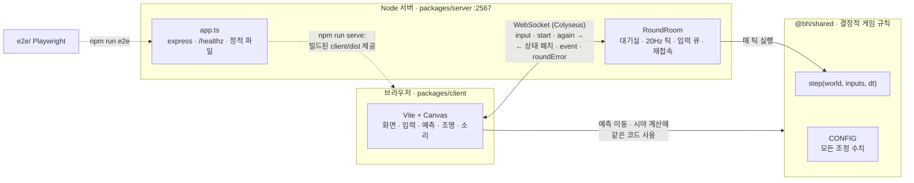
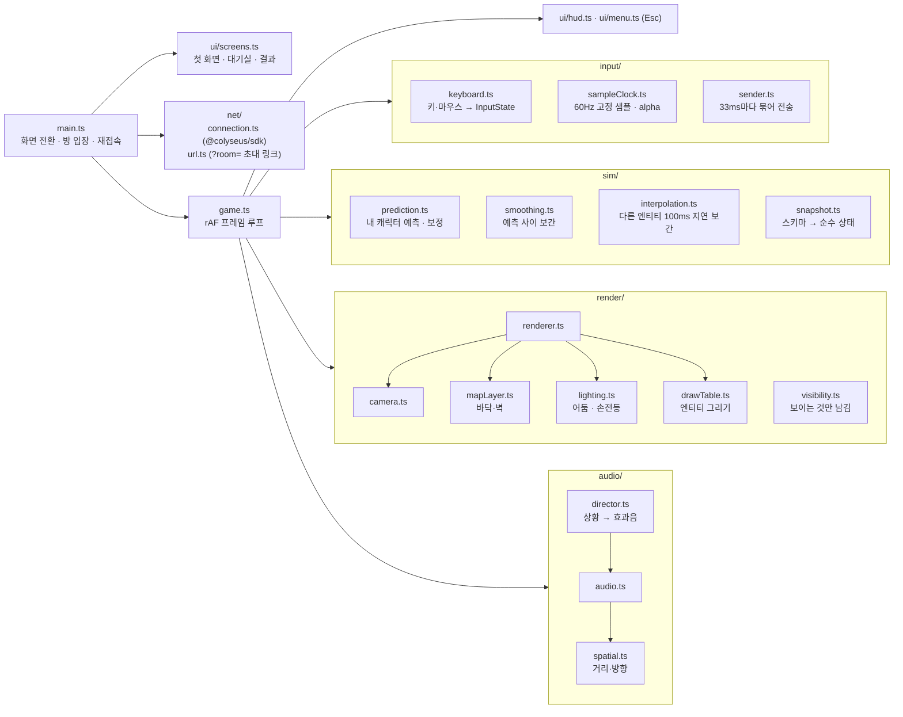
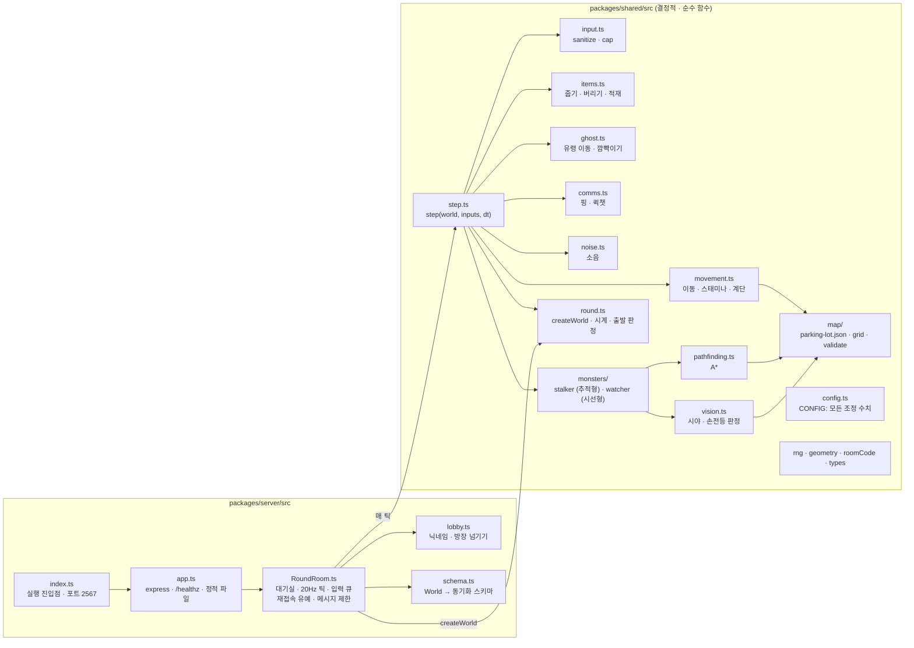
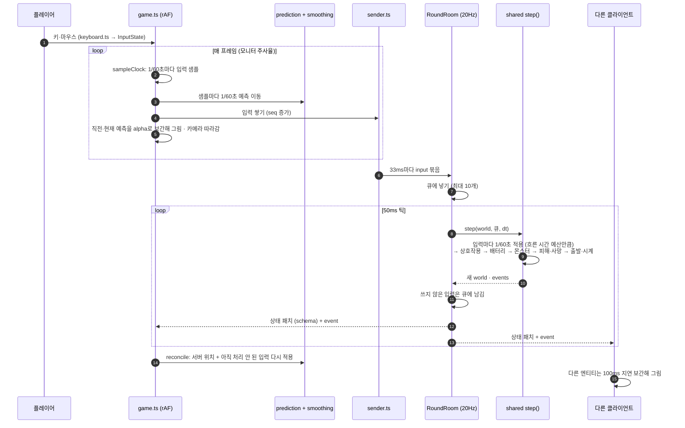

# 아키텍처

하위 프로젝트 1(라운드 1회) 기준 구조. 규칙은 `@bh/shared`에만 있고, 서버는 그것을 실행하며,
클라이언트는 예측 이동과 시야 계산에만 같은 코드를 쓴다(스펙 2장, 3.3).

## 1. 전체 구조

## 2. 클라이언트 모듈 (packages/client/src)

## 3. 서버와 공용 규칙 모듈

## 4. 한 프레임 · 한 틱의 데이터 흐름

